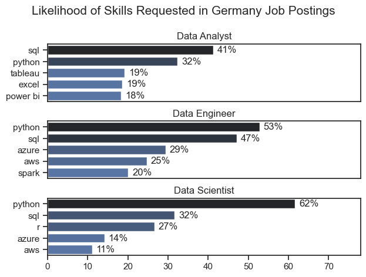
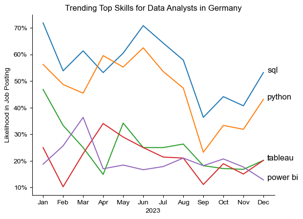
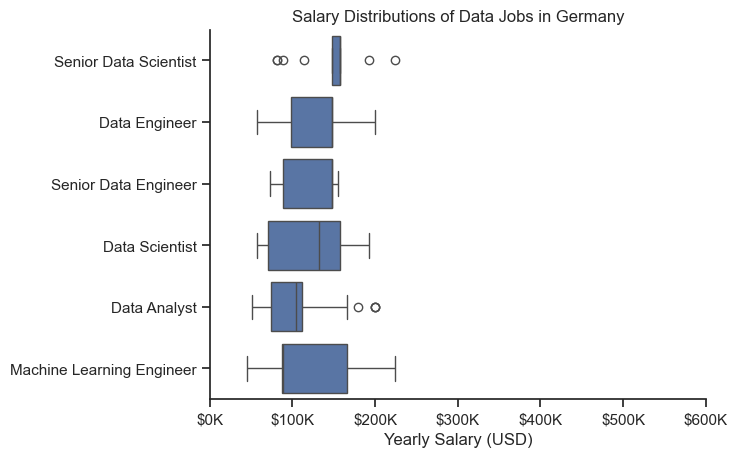
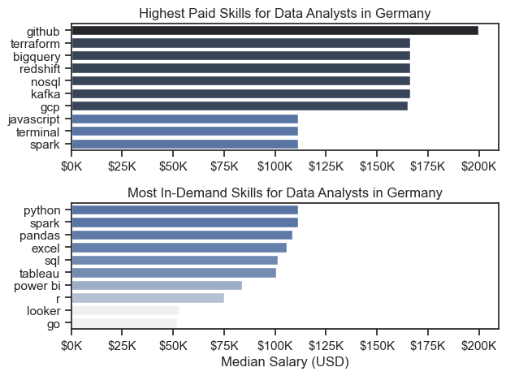
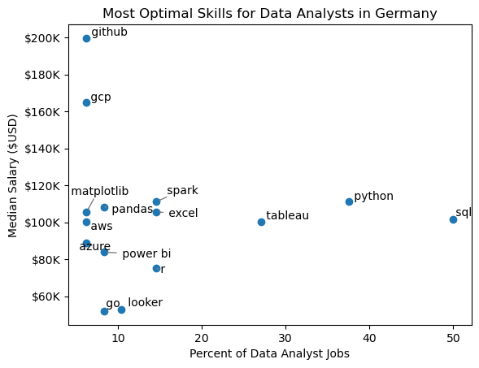
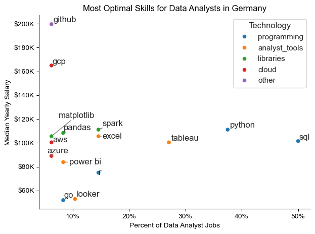

# Overview

Welcome to my analysis of the data job market, focusing on data analyst roles. This project was created out of a desire to navigate and understand the job market more effectively. It delves into the top-paying and in-demand skills to help find optimal job opportunities for data analysts.

The data sourced from [Luke Barousse's Python Course](https://lukebarousse.com/python) which provides a foundation for my analysis, containing detailed information on job titles, salaries, locations, and essential skills. Through a series of Python scripts, I explore key questions such as the most demanded skills, salary trends, and the intersection of demand and salary in data analytics.

# The Questions

Below are the questions I want to answer in my project:

1. What are the skills most in demand for the top 3 most popular data roles?
2. How are in-demand skills trending for Data Analysts?
3. How well do jobs and skills pay for Data Analysts?
4. What are the optimal skills for data analysts to learn? (High Demand AND High Paying) 

# Tools I Used

For my deep dive into the data analyst job market, I harnessed the power of several key tools:

- **Python:** The backbone of my analysis, allowing me to analyze the data and find critical insights.I also used the following Python libraries:
    - **Pandas Library:** This was used to analyze the data. 
    - **Matplotlib Library:** I visualized the data.
    - **Seaborn Library:** Helped me create more advanced visuals. 
- **Jupyter Notebooks:** The tool I used to run my Python scripts which let me easily include my notes and analysis.
- **Visual Studio Code:** My go-to for executing my Python scripts.
- **Git & GitHub:** Essential for version control and sharing my Python code and analysis, ensuring collaboration and project tracking.

# Data Preparation and Cleanup

This section outlines the steps taken to prepare the data for analysis, ensuring accuracy and usability.

## Import & Clean Up Data

I start by importing necessary libraries and loading the dataset, followed by initial data cleaning tasks to ensure data quality.

Due to internet connectivity issues with Hugging Face's dataset downloads, here's an alternative solution for loading the data locally:

1. Manual Download Instructions:
Visit Luke Barousse's dataset on Hugging Face
Download the CSV file manually
Save it to your local project directory (e.g., in a data folder).This solution is more straightforward and doesn't require a stable connection to Hugging Face's servers.

2. Code Modification: Instead of using load_dataset, use this simpler approach and continue with the same data cleanup:

```python
# Alternative code for local CSV
import pandas as pd

# Adjust the path to where you saved the CSV file
df = pd.read_csv("/path/to/your/data_jobs.csv")

```

This solution is more straightforward and doesn't require a stable connection to Hugging Face's servers.

## Filter DE Jobs

To focus my analysis on the Germany job market, I apply filters to the dataset, narrowing down to roles based in the United States.

```python
df_DE = df[df['job_country'] == 'Germany']

```

# The Analysis

Each Jupyter notebook for this project aimed at investigating specific aspects of the data job market. Here’s how I approached each question:

## 1. What are the most demanded skills for the top 3 most popular data roles?

To find the most demanded skills for the top 3 most popular data roles. I filtered out those positions by which ones were the most popular, and got the top 5 skills for these top 3 roles. This query highlights the most popular job titles and their top skills, showing which skills I should pay attention to depending on the role I'm targeting. 

View my notebook with detailed steps here: [2_Skill_Demand](2_Skill_Demand.ipynb).

### Visualize Data

```python
fig, ax = plt.subplots(len(job_titles), 1)


for i, job_title in enumerate(job_titles):
    df_plot = df_skills_perc[df_skills_perc['job_title_short'] == job_title].head(5)[::-1]
    sns.barplot(data=df_plot, x='skill_percent', y='job_skills', ax=ax[i], hue='skill_count', palette='dark:b_r')

plt.show()
```

### Results




*Bar graph visualizing the salary for the top 3 data roles and their top 5 skills associated with each.*

### Insights:

- Python and SQL are consistently in the top 2 for all roles
- Cloud platforms (Azure, AWS) are more important for Engineers than Analysts
- Visualization tools appear only in Analyst requirements
- Data Scientists have the highest Python requirement
- Engineers have the most balanced distribution of required skills

## 2. How are in-demand skills trending for Data Analysts?

To find how skills are trending in 2023 for Data Analysts, I filtered data analyst positions and grouped the skills by the month of the job postings. This got me the top 5 skills of data analysts by month, showing how popular skills were throughout 2023.

View my notebook with detailed steps here: [3_Skills_Trend](3_Skills_Trend.ipynb).

### Visualize Data

```python

from matplotlib.ticker import PercentFormatter

df_plot = df_DA_US_percent.iloc[:, :5]
sns.lineplot(data=df_plot, dashes=False, legend='full', palette='tab10')

plt.gca().yaxis.set_major_formatter(PercentFormatter(decimals=0))

plt.show()

```

### Results

  
*Bar graph visualizing the trending top skills for data analysts in Germany in 2023.*

### Insights:
- SQL and Python consistently remain the top two required skills throughout 2023
    - SQL has the highest overall demand, peaking at ~70% in June
    - Python is the second most demanded skill, generally fluctuates between 45-60%
- The demand patterns show significant monthly fluctuations rather than steady trends
    - Data visualization Tools maintain lower but stable demand (15-25% range), and Tableau slightly more preferred than Power BI
    - Core technical skills (SQL, Python) remain fundamental requirements


## 3. How well do jobs and skills pay for Data Analysts?

To identify the highest-paying roles and skills, I only got jobs in the United States and looked at their median salary. But first I looked at the salary distributions of common data jobs like Data Scientist, Data Engineer, and Data Analyst, to get an idea of which jobs are paid the most. 

View my notebook with detailed steps here: [4_Salary_Analysis](4_Salary_Analysis.ipynb).

#### Visualize Data 

```python
sns.boxplot(data=df_US_top6, x='salary_year_avg', y='job_title_short', order=job_order)

ticks_x = plt.FuncFormatter(lambda y, pos: f'${int(y/1000)}K')
plt.gca().xaxis.set_major_formatter(ticks_x)
plt.show()

```

#### Results

  
*Box plot visualizing the salary distributions for the top 6 data job titles.*

#### Insights

- This box plot reveals clear salary hierarchies and variations across different data roles in Germany. Machine Learning Engineers show the widest salary range ($50K-$250K) with a median around $125K, while Senior Data Scientists, despite having some outliers above $300K, maintain a more compact salary band. 

- Data Engineers and Senior Data Engineers cluster in similar ranges ($75K-$150K), with seniors commanding slightly higher medians. Regular Data Scientists show significant spread ($50K-$200K), suggesting varied experience levels or company sizes. 

- Data Analysts have the most concentrated salary range ($50K-$150K) with some outliers reaching $250K, indicating this is typically an entry to mid-level position. Notably, all roles maintain a minimum threshold of around $50K, suggesting a strong baseline for data professionals in the German market.

### Highest Paid & Most Demanded Skills for Data Analysts

Next, I narrowed my analysis and focused only on data analyst roles. I looked at the highest-paid skills and the most in-demand skills. I used two bar charts to showcase these.

#### Visualize Data

```python

fig, ax = plt.subplots(2, 1)  

# Top 10 Highest Paid Skills for Data Analysts
sns.barplot(data=df_DA_top_pay, x='median', y=df_DA_top_pay.index, hue='median', ax=ax[0], palette='dark:b_r')

# Top 10 Most In-Demand Skills for Data Analystsr')
sns.barplot(data=df_DA_skills, x='median', y=df_DA_skills.index, hue='median', ax=ax[1], palette='light:b')

plt.show()

```

#### Results
Here's the breakdown of the highest-paid & most in-demand skills for data analysts in the US:



*Two separate bar graphs visualizing the highest paid skills and most in-demand skills for data analysts in Germany.*

#### Insights:

- The top graph shows specialized technical skills like `dplyr`, `Bitbucket`, and `Gitlab` are associated with higher salaries, some reaching up to $200K, suggesting that advanced technical proficiency can increase earning potential.

- The bottom graph highlights that foundational skills like `Excel`, `PowerPoint`, and `SQL` are the most in-demand, even though they may not offer the highest salaries. This demonstrates the importance of these core skills for employability in data analysis roles.

- There's a clear distinction between the skills that are highest paid and those that are most in-demand. Data analysts aiming to maximize their career potential should consider developing a diverse skill set that includes both high-paying specialized skills and widely demanded foundational skills.

## 4. What are the most optimal skills to learn for Data Analysts?

To identify the most optimal skills to learn ( the ones that are the highest paid and highest in demand) I calculated the percent of skill demand and the median salary of these skills. To easily identify which are the most optimal skills to learn. 

View my notebook with detailed steps here: [5_Optimal_Skills](5_Optimal_Skills.ipynb).

#### Visualize Data

```python
from adjustText import adjust_text
import matplotlib.pyplot as plt

plt.scatter(df_DA_skills_high_demand['skill_percent'], df_DA_skills_high_demand['median_salary'])
plt.show()

```

#### Results

    
*A scatter plot visualizing the most optimal skills (high paying & high demand) for data analysts in Germany.*

#### Insights:

- The scatter plot reveals a complex relationship between skill demand and salary levels in the German data analyst market. SQL and Python emerge as the most frequently required skills (50% and 40% of job postings respectively), offering solid median salaries around $100K-110K. 

- Cloud-related skills like GitHub and GCP command premium salaries ($160K-200K) despite lower demand (~10%), indicating they're highly valued specialty skills. Traditional data analysis tools (Tableau, Excel) show moderate demand (20-30%) with salaries around $100K. 

- Data manipulation libraries (pandas, matplotlib) and cloud platforms (AWS, Azure) cluster in the 10-15% demand range with $100-110K salaries. Notably, visualization tools like Power BI and Go Looker sit at the lower end of the salary spectrum ($60K-80K) with relatively low demand, suggesting they might be considered more entry-level requirements.


### Visualizing Different Techonologies

Let's visualize the different technologies as well in the graph. We'll add color labels based on the technology (e.g., {Programming: Python})

#### Visualize Data

```python
from matplotlib.ticker import PercentFormatter

# Create a scatter plot
scatter = sns.scatterplot(
    data=df_DA_skills_tech_high_demand,
    x='skill_percent',
    y='median_salary',
    hue='technology',  # Color by technology
    palette='bright',  # Use a bright palette for distinct colors
    legend='full'  # Ensure the legend is shown
)
plt.show()

```

#### Results

  
*A scatter plot visualizing the most optimal skills (high paying & high demand) for data analysts in the US with color labels for technology.*

#### Insights:

- This scatter plot reveals fascinating insights about skill demands and salary correlations in the German data analyst market. SQL and Python stand out as the most commonly required skills (appearing in 50% and ~40% of job postings respectively) with strong median salaries around $100K-110K. 
- Cloud platforms (GitHub, GCP) command the highest salaries ($160K-200K) despite lower demand (10%), suggesting they're premium skills. Traditional analyst tools like Tableau (30% demand) and Excel (18% demand) offer moderate salaries around $100K, while specialized libraries (matplotlib, pandas) and cloud services (AWS, Azure) cluster around $100-110K with 10-15% demand. 
- Interestingly, tools like Power BI and Go Looker show lower salary ranges ($80-90K) despite being industry-specific tools, indicating they might be considered more entry-level or supplementary skills.

# What I Learned

Throughout this project, I deepened my understanding of the data analyst job market and enhanced my technical skills in Python, especially in data manipulation and visualization. Here are a few specific things I learned:

- **Advanced Python Usage**: Utilizing libraries such as Pandas for data manipulation, Seaborn and Matplotlib for data visualization, and other libraries helped me perform complex data analysis tasks more efficiently.
- **Data Cleaning Importance**: I learned that thorough data cleaning and preparation are crucial before any analysis can be conducted, ensuring the accuracy of insights derived from the data.
- **Strategic Skill Analysis**: The project emphasized the importance of aligning one's skills with market demand. Understanding the relationship between skill demand, salary, and job availability allows for more strategic career planning in the tech industry.


# Insights

This project provided several general insights into the data job market for analysts:

- **Skill Demand and Salary Correlation**: There is a clear correlation between the demand for specific skills and the salaries these skills command. Advanced and specialized skills like Python and Oracle often lead to higher salaries.
- **Market Trends**: There are changing trends in skill demand, highlighting the dynamic nature of the data job market. Keeping up with these trends is essential for career growth in data analytics.
- **Economic Value of Skills**: Understanding which skills are both in-demand and well-compensated can guide data analysts in prioritizing learning to maximize their economic returns.


# Challenges I Faced

This project was not without its challenges, but it provided good learning opportunities:

- **Data Inconsistencies**: Handling missing or inconsistent data entries requires careful consideration and thorough data-cleaning techniques to ensure the integrity of the analysis.
- **Complex Data Visualization**: Designing effective visual representations of complex datasets was challenging but critical for conveying insights clearly and compellingly.
- **Balancing Breadth and Depth**: Deciding how deeply to dive into each analysis while maintaining a broad overview of the data landscape required constant balancing to ensure comprehensive coverage without getting lost in details.


# Conclusion

This exploration into the data analyst job market has been incredibly informative, highlighting the critical skills and trends that shape this evolving field. The insights I got enhance my understanding and provide actionable guidance for anyone looking to advance their career in data analytics. As the market continues to change, ongoing analysis will be essential to stay ahead in data analytics. This project is a good foundation for future explorations and underscores the importance of continuous learning and adaptation in the data field.
